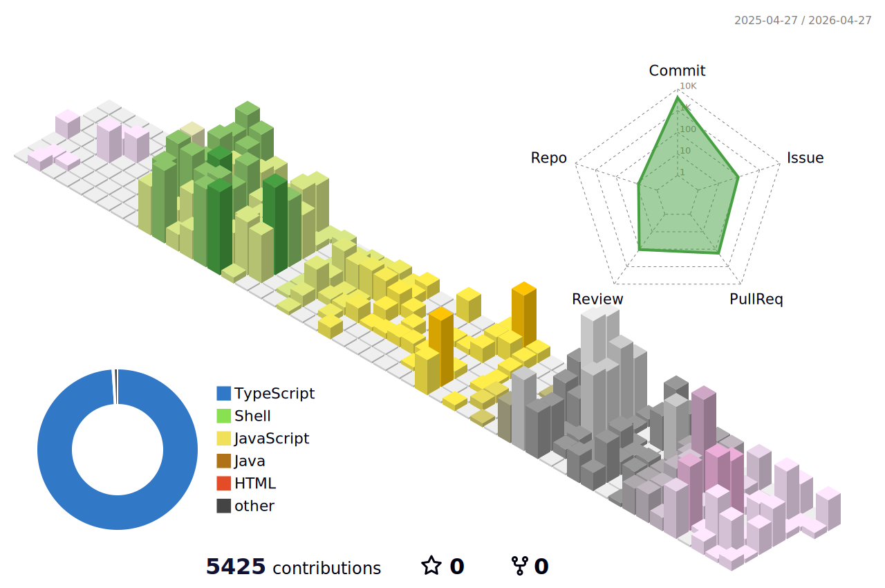

## About Me

- Currently diving into **TypeScript / Next.js / TailwindCSS**
- Building **user-friendly, interactive** web apps
- Enjoy sharing knowledge & documenting growth
- Aiming to grow into a **Fullstack Developer** balancing design x logic

---

## Tech Stack

**Frontend**

**Tools**

---

## Contribution Graph

  

---

