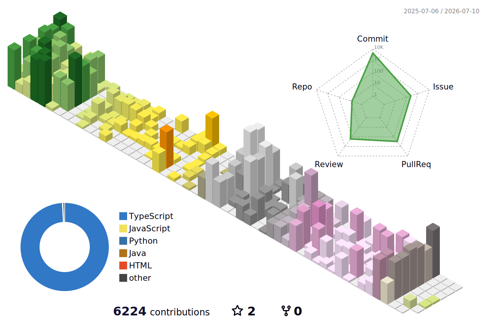

## About Me

I aspire to be a developer who doesn't settle for the given frame — someone who learns, challenges, and moves forward. I enjoy diving into new technologies and unfamiliar problems head-on rather than avoiding them.

Currently building expertise in frontend while gradually expanding into backend, with the goal of becoming a fullstack developer.

In an age where AI evolves rapidly, I believe the ability to think and design independently — without relying solely on tools — is more critical than ever. My goal is to be a grounded developer who isn't swept away by technology trends.

As a developer who has also experienced the PM role, I can speak the language of both planning and engineering. My strength lies in crossing boundaries within a team to see the product from a broader perspective.

---

주어진 틀에 안주하지 않고, 스스로 배우고 도전하며 앞으로 나아가는 개발자를 지향합니다. 새로운 기술이나 낯선 문제를 마주했을 때 피하기보단 직접 부딪히며 배워가는 걸 즐깁니다.

현재는 프론트엔드 기반으로 역량을 쌓고 있으며, 점차 백엔드 영역까지 확장해 풀스택 개발자를 목표로 도전 중입니다.

AI가 빠르게 발전하는 시대일수록, 도구에 의존하지 않고 스스로 생각하고 설계할 수 있는 능력이 중요하다고 믿습니다. 기술의 흐름에 휩쓸리지 않는 단단한 개발자가 되는 것을 목표로 합니다.

개발자이지만 PM 역할도 경험하며 기획과 개발 사이의 언어를 모두 구사할 수 있습니다. 팀 안에서 경계를 넘나들며 더 넓은 시각으로 제품을 바라보는 것이 저의 강점입니다.

[blog.issac.app](https://blog.issac.app)

---

## Projects

| Project | Description | Period | Role | Highlight |
|---------|-------------|--------|------|-----------|
| [omechu](https://github.com/Team-Omechu/Omechu-web) | 식사 메뉴 추천 서비스 | 2025.06 ~ 2026.02 | FE Architecture | FSD 전환, Lighthouse SEO 100, 주간 방문자 598명 |
| [낭낭](https://github.com/nerdinary-hackathon-9th/nerdinary-front) | 챌린지 기반 습관 관리 서비스 | 2025.11 | FE (48.6%) | 너디너리 해커톤 우수상 |
| [gitguardian](https://github.com/azizbekdevuz/gitguardian) | AI 기반 Git 복구 도구 | 2025.12 | Team Lead | Scoop AI 해커톤 2위 ($8K), 영어 협업 |
| [NOVA](https://github.com/NOVA-9th/nova-fe) | IT 취준생을 위한 AI 콘텐츠 큐레이션 플랫폼 | 2025.12 ~ 2026.02 | FE & PM | OpenAI 기반 아티클 요약, 개인화 피드, 실서비스 운영 |
| [stocat](https://github.com/stocat/stocat-fe) | 모의주식 거래 플랫폼 | 2025.12 ~ 현재 | FE Solo (83.3%) | Vanilla Extract, 2단계 색상 토큰 체계 |
| [경도팟](https://github.com/UMC-9th-hackathon-TEAM5/FE) | 위치 기반 실시간 추격 게임 | 2026.01 | FE Lead (72.5%) | UMC 해커톤 최우수상, PWA + Naver Maps |

---

## Tech Stack

**Frontend**

 

 

**Others**

**Tools**

 

---

## Contribution Graph

  

---

